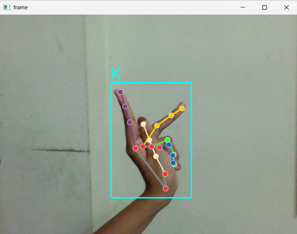
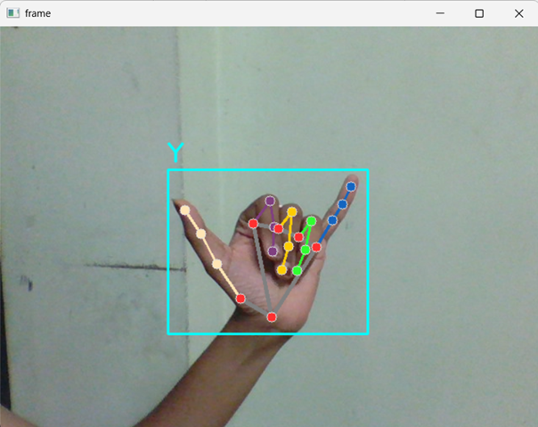
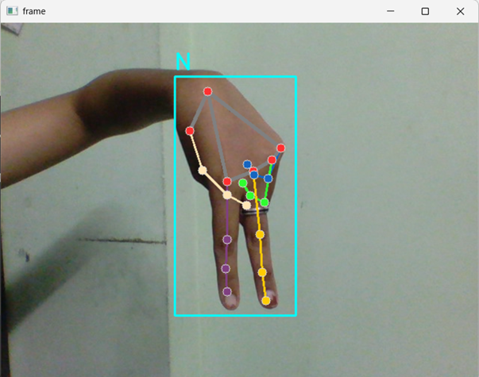
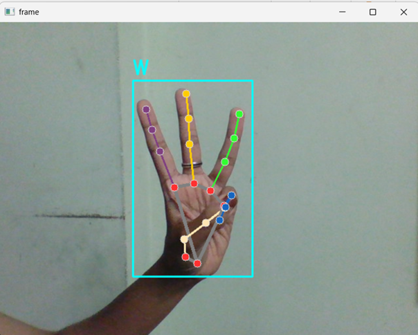

# ASL Hand Gesture Recognition with MediaPipe & Random Forest

This project enables real-time recognition of American Sign Language (ASL) gestures using computer vision and machine learning. It uses **MediaPipe** to extract hand landmarks and trains a **Random Forest Classifier** to identify 28 different hand signs (A–Z, space, nothing).

---

## Overview

The objective of this project is to recognize static ASL hand signs using webcam input and classify them accurately using a machine learning model. It involves:

- Dataset creation via webcam
- Landmark detection using MediaPipe
- Training a Random Forest model
- Real-time prediction through OpenCV

---

##  Machine Learning Pipeline

- **Model**: `Random Forest Classifier`
- **Input Features**: 42-D vector (21 hand landmarks × 2 coordinates)
- **Labels**: ASL Alphabets A–Z + space + nothing
- **Data Processing**:
  - Normalization of landmark positions
  - Consistency check in data length
- **Evaluation Metric**:
  - Accuracy score on test data
- **Saving**:
  - Landmark dataset as `data.pkl`
  - Trained model as `model.pkl`

---

##  System Workflow

### 1.  **Data Collection** (`data_collection.py`)
Capture 100 hand gesture samples per class via webcam, saved to class-specific folders.

### 2.  **Feature Extraction** (`feature_extraction.py`)
Use **MediaPipe Hands** to extract 21 (x, y) landmarks per image and store them in `data.pkl`.

### 3.  **Model Training** (`train_model.py`)
Train a `RandomForestClassifier` on the processed landmark data and evaluate its performance.

### 4.  **Real-Time Prediction** (`detect_asl.py`)
Run the live ASL detector using your webcam. The model predicts and displays the gesture with a bounding box and label.

---

## ASL Detection in Action

| Letter K | Letter Y |
|--------|--------|
|  |  |
| Letter N | Letter W |
|  |  |

---

##  Tech Stack

- **Language**: Python
- **Libraries**: OpenCV, MediaPipe, Scikit-learn, NumPy, Pickle
- **Model**: Random Forest (Scikit-learn)

---

###  Reference

Based on: 
[Sign language detection with Python and Scikit Learn (by Computer vision engineer)l]
[https://www.youtube.com/watch?v=sz25xxF_AVE]
